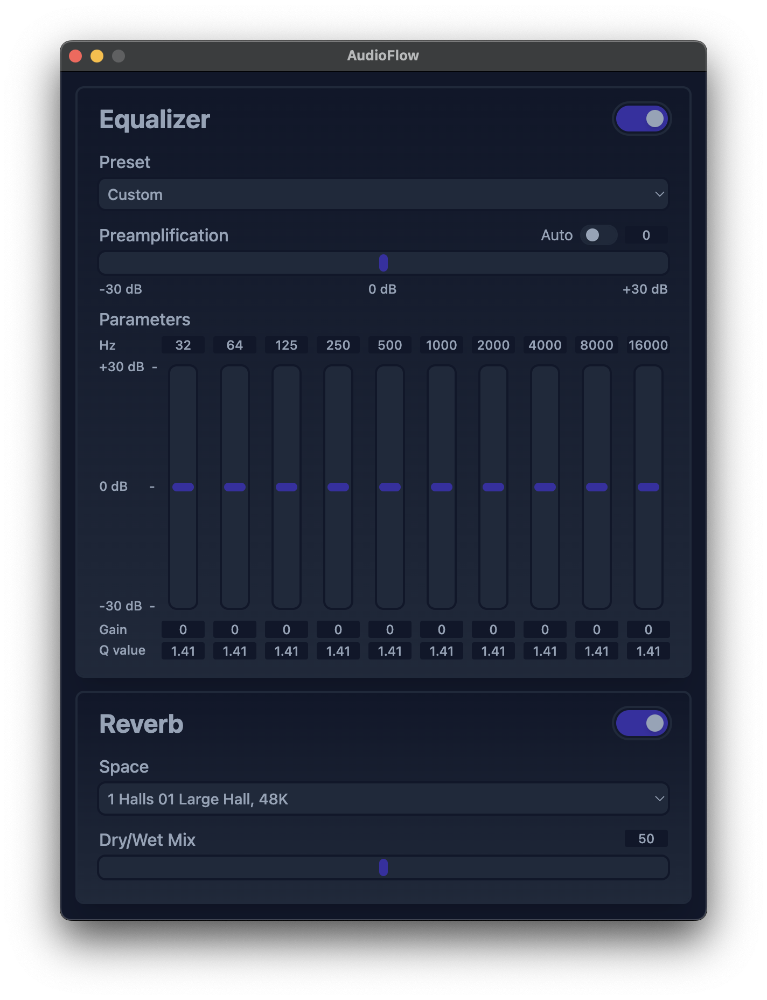

# AudioFlow
AudioFlow is a MacOS system audio equalizer designed to be simple, lightweight, and robust. AudioFlow currently features a 10 band equalizer and a convolution reverb unit. AudioFlow is built in C++ and is powered by Apple's CoreAudio and Accelerate frameworks.

## Demo
https://github.com/user-attachments/assets/41a625e8-e656-4a86-a6b3-8140cdd7d376

## Table of Contents
- [Installation Instructions](#installation-instructions)
- [Uninstallation Instructions](#uninstallation-instructions)
- [Usage](#usage)
- [Features](#features)
- [User Interface](#user-interface)
- [Contributing](#contributing)
- [Credits](#credits)

## Installation Instructions
1. Download the most recent release from https://github.com/jeremicna/AudioFlow/releases
2. Navigate to:\
```cd {PATH_TO_RELEASE}/AudioFlow.app```
3. Execute the installer:\
```sh Contents/Resources/scripts/installer.sh```\
Note: This script may prompt password input as it moves the virtual audio device driver from ```assets/driver``` to ```/Library/Audio/Plug-Ins/HAL``` which requires administrator privileges. Alternatively, it is possible to manually move it. This script also temporarily contains a command which disables the apple quarantine the prevents the app from being opened due to the fact the builds are not currently notarized. 
4. Restart CoreAudio:\
```sudo killall -9 coreaudiod```

## Uninstallation Instructions
1. Navigate to:\
   ```cd /Applications/AudioFlow.app```
2. Execute the uninstaller:
   ```sh Contents/Resources/scripts/uninstaller.sh```
3. Restart CoreAudio:\
   ```sudo killall -9 coreaudiod```

## Usage
To use AudioFlow, simply open the application and AudioFlow will automatically switch to the ```AudioFlow 2ch``` audio device and route the processed audio to the last selected audio device.

## Features
* Equalizer
  * 10 Bands
  * Simple presets
  * Auto preamplification
  * Adjustable gain, frequency, and quality factor (Q)

* Reverb unit
  * Convolution based
  * 135 impulse responses representing different audiospatial environments to choose from
  * Adjustable mixing (dry/wet)

## User Interface


## Contributing
All contributions are welcome. Whether you're fixing a bug, adding a new feature, or have an issue, feel free to open a pull request/issue/etc.

## Credits
This project uses the BlackHole Audio Loopback Driver by @ExistentialAudio to capture system audio. https://github.com/ExistentialAudio/BlackHole
